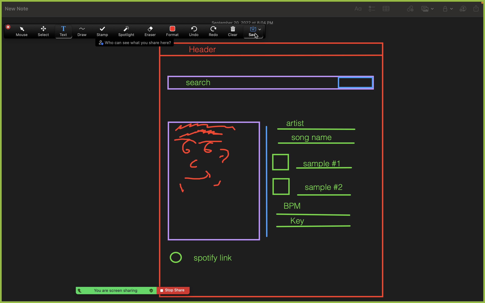

# Tasty-Tunage
This application allows the user to search up a song, the application then presents song title, artist name, sampled tracks (if applicable), lyrics 

## User Story
- AS an audiophile
- I WANT to search up a song
- SO THAT I can see data about the artist, song, and sampled tracks.

## Acceptance Criteria
- GIVEN a song title
- WHEN I type in a song name
- THEN I am presented with the song art, artist name, song name, sampled tracks, and lyrics
- WHEN I click on the song art
- THEN I am redirected to the song's Spotify page
- IF the sample has a track on Spotify
- THEN I am redirected to the sample's Genius page
- IF the sample doesn't have a track on Genius page
- THEN I am presented with nothing

## APIs
- GeniusAPI
- SpotifyAPI
- BootstrapAPI

## MockUp
